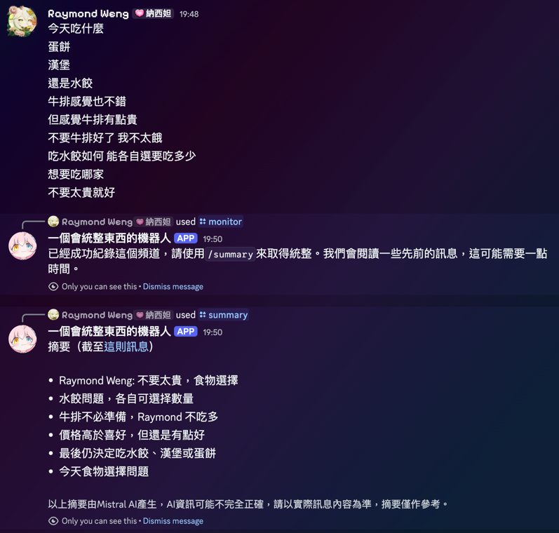
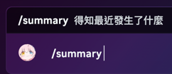

# 一個會統整訊息的機器人

## 簡介

這是一個能夠整理Discord頻道訊息的機器人，能夠將指定頻道的訊息整理成一個清單，方便用戶查看和管理。

在開始監視後，機器人會記錄訊息並總結訊息，在使用`/summary`時，機器人會將總結的訊息傳給使用者。



> 因為是7B模型，效果可能有待加強。未來可能提供自訂模型功能。我也將努力優化。

## 嘗試這個機器人

加入[這個Discord伺服器](https://discord.gg/QH2yyXGAZp)來嘗試這個機器人。

如果你想將他加入你的伺服器：很抱歉，因為效能有限，目前不打算開放給所有伺服器使用。有打算開放給部分伺服器設置，如果

- 你的伺服器是公開的
- 你的伺服器有一定的活躍度
- 你願意提供一些反饋來幫助我改進這個機器人
- 接受這個機器人紀錄部分聊天內容

歡迎聯絡我（可能可以在Blog中翻到我的聯絡方式，或是在Threads貼文下方留言或私訊）

如果你願意自行部署這個機器人，也可以參考下方的「自行部署」部分。

等到開發得差不多了，我會開放更多伺服器使用（可能採用訂閱制等等）。

## 使用方法（面向使用者）

在已經被監控的頻道中，使用`/summary`指令，機器人會將總結的訊息傳給使用者。



如果機器人回覆

> 目前沒有摘要，傳送訊息後會我們會開始閱讀，並在訊息量變多時產生摘要，請稍後再試一次！

請嘗試開始對話，機器人會在訊息累積超過10則後開始產生摘要。

如果機器人回覆

> 這個頻道沒有被我們紀錄。為了節約效能，我們並不會紀錄每個頻道，如果需要紀錄，請使用/monitor指令（目前僅開發者可用，如有需要請聯絡Raymond Weng）。

則代表該頻道尚未被監控，請聯絡開發者以啟用監控。

## 自行部署

> 請注意：部署時請不要盲目相信任何指令。遇到不熟悉的指令請自行確認內容並確認是否會造成危險（或過時）。本人不對任何因使用本機器人而造成的損失負責。

> 部署時，希望你能將我的名字放在機器人的介紹或相關文件中，讓更多人知道是我開發的，謝謝。

你需要準備

- 一台電腦，可以是任何作業系統（包括但不限於Windows, Mac），但是必須可以運行Ollama
- 一台電腦，可以是同一台，也可以是不同的，必須可以運行Java 26（建議使用此版本，因未於其他版本測試可行性）
- 一個Discord帳號
- 一個Discord機器人（你應該可以在網路上找到教學，可以在Discord開發者平台中建立）

> 請注意，電腦需要一直開機並保持網路連線，機器人才會一直運行。

在部署過程中遇到問題都可以從主頁進到我到Blog找到我的信箱或其他聯絡方式詢問。或者，你也可以到Threads來找我。

我們開始安裝：

1. 下載Ollama（可參考[官網](https://ollama.com)）
2. 取得Mistral 7B模型，執行以下指令

```bash
ollama pull mistral
```

3. 從[Releases](https://github.com/Raymond-Weng/summary-bot/releases)下載最新版本的`summary-bot.zip`。
4. 解壓縮`summary-bot.zip`，內容架構如下

```
summary-bot
├── summary-bot.jar
├── env
│   └── .env
│── db                  
└─ └── monitored_channels.db
```

4. 在`env/.env`中填入必要的環境變數，具體內容如下：

```dotenv
DISCORD_BOT_TOKEN=

DISCORD_MONITOR_CHANNEL_ID=
DISCORD_SUMMARY_CHANNEL_ID=
DISCORD_EXCEPTION_CHANNEL_ID=
DISCORD_CHANNEL_COUNT_VOICE_CHANNEL_ID=

OLLAMA_API_URL=

DISCORD_ADMIN_USER_ID=
```

其中：
- `DISCORD_BOT_TOKEN`：你的Discord機器人Token。***請勿暴露你的Token給他人***
- `DISCORD_MONITOR_CHANNEL_ID`：新增監控頻道時會通知你，通知的頻道ID。（若不需請填寫-1）
- `DISCORD_SUMMARY_CHANNEL_ID`：製作總結、請求總結時會通知你，通知的頻道ID。（若不需請填寫-1）
- `DISCORD_EXCEPTION_CHANNEL_ID`：異常訊息要發送到的頻道ID。（若不需請填寫-1）
- `DISCORD_CHANNEL_COUNT_VOICE_CHANNEL_ID`：語音頻道ID，用於顯示監控頻道數量。（若不需請填寫-1）
- `OLLAMA_API_URL`：Ollama API的URL。需要包含`/api/generate`，例如bot和ollama運行在同一台機器時可以輸入`http://localhost:11434/api/generate` ）
- `DISCORD_ADMIN_USER_ID`：管理員的Discord用戶ID，僅管理員可以使用/monitor等指令。

請注意：
- 機器人必須在Discord開發者平台中的Bot分頁啟用「Message Content Intent」。
- ID可以右鍵頻道或用戶，選擇「複製ID」來獲取。
- 除VOICE_CHANNEL_ID外，其他頻道ID必須是文字頻道，且機器人需要有權限在這些頻道中發送訊息。
- 對於VOICE_CHANNEL需要有管理權限，以便更新頻道名稱顯示監控頻道數量。
- 機器人必須要有「View Channels」、「Read Message History」等權限，如沒特殊顧慮可給予Admin權限避免遇到問題。

5. 使用Java Development Kit (JDK) 26版本（建議使用此版本，因未於其他版本測試可行性）運行`summary-bot.jar`。

```bash
java -jar summary-bot.jar
```

6. 將機器人加入你的Discord伺服器，並確保機器人有足夠的權限。可以在Discord開發者平台的OAuth2分頁中勾選bot後生成邀請連結，選擇適當的權限後使用該連結將機器人加入伺服器。

## 資料使用

這個機器人會記錄的資料如下

- 被監控的頻道所在伺服器的名稱
- 被監控的頻道的名稱
- 被監控的頻道的ID
- 被監控的頻道中，未處理訊息作者、內容、時間等相關資訊
- 被監控的頻道中，已處理訊息的作者、內容、時間等相關資訊在刪除前可能會被短暫留存
- 被監控的頻道中，已處理訊息的摘要內容
- 觸發總結、使用指令的時機和頻道
- 機器人運行過程中產生的異常訊息

以上資訊會用作提示詞的內容交給Mistral模型，以產生摘要內容。